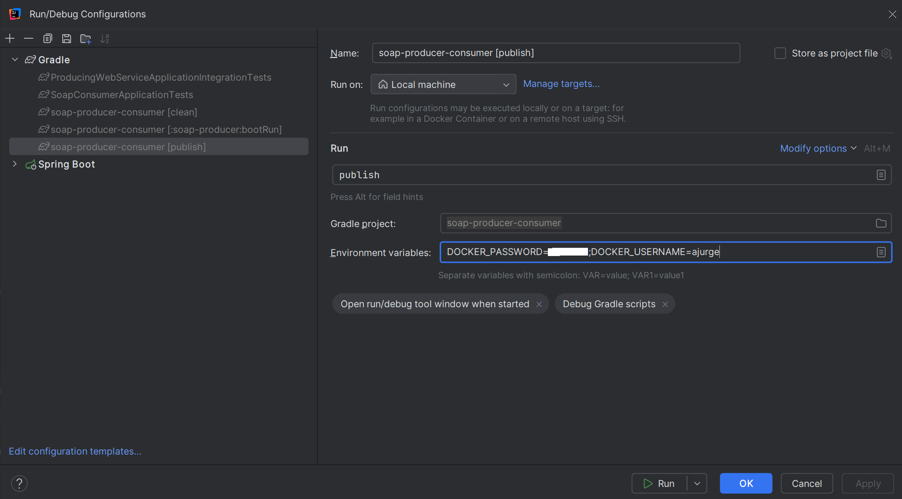

# Build and Run

- Java 23
- docker

Set the following environmental variables:
```
DOCKER_USERNAME=dockerhub-usr
DOCKER_PASSWORD=dockerhub-pwd
```

It is sufficient to set the environmental variables just for the `./gradlew publish` task:


## Build

First build and run the soap-producer: `./gradlew :soap-producer:bootRun`

`./gradlew publish`

Stop the `./gradlew :soap-producer:bootRun`

## Run

`docker-compose --env-file docker.env up`

Alternatively run as java processes locally:

`./gradlew :soap-producer:bootRun`

`./gradlew :soap-consumer:bootRun`


Swagger UI: http://localhost:8080/swagger-ui.html

